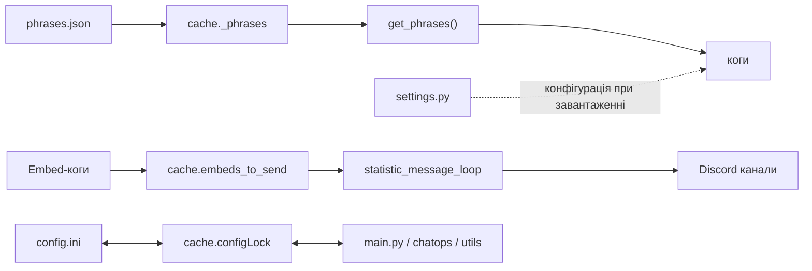

# Архітектура Olive Bot

## Загальна схема

```
main.py  -->  core/bot.py (OliveBot)
                  │
                  ├── core/cache.py      (глобальний стан)
                  ├── core/utils.py      (утиліти + фрази)
                  ├── modules/           (зовнішні інтеграції)
                  └── cogs/              (модулі бота)
                        ├── statistic_message_loop.py  (головний цикл виводу)
                        ├── hosting_embed.py
                        ├── currency_embed.py
                        ├── battery_embed.py
                        ├── uptime_embed.py
                        ├── active_cogs_embed.py
                        ├── olive.py          (AI-асистент)
                        ├── chatops.py        (git pull, reload, debug)
                        ├── errors.py         (обробка помилок)
                        ├── phrases_tools.py  (редагування фраз)
                        └── utils.py          (ping, статистика, події)
```

## Точка входу — `main.py`

1. Створює екземпляр `OliveBot` з інтентами та списком тестових серверів.
2. Завантажує фрази з `phrases.json` через `core.utils.load_phrases()`.
3. Автоматично знаходить та завантажує всі `.py`-файли з директорії `cogs/`.
4. Читає токен бота з файлу (шлях задано в `settings.py`) і запускає бота.
5. У `on_ready` ініціалізує `configLock`, перевіряє час з останнього запуску через `config.ini` та надсилає повідомлення про старт у канал `bot_news`.

## Ядро (`core/`)

### `core/bot.py` — OliveBot

Наслідує `commands.Bot` з disnake. Перевизначає:
- `load_extension()` — при завантаженні когу записує час завантаження в `cache.active_cogs_list`.
- `unload_extension()` — при вивантаженні видаляє ког зі списку активних.
Створює:
- `get_or_fetch_channel()` — спочатку шукає канал у кеші disnake, потім робить запит до API, якщо нема кешу.

### `core/cache.py` — Глобальний стан

Набір глобальних змінних, які використовуються як спільний стан між когами:

| Змінна | Призначення |
|--------|-------------|
| `embeds_to_send` | Словник embed-об'єктів, які `statistic_message_loop` відправляє в канали. |
| `configLock` | `asyncio.Lock` для безпечного доступу до `config.ini`. |
| `llm_client` | Екземпляр `LLMClient` для AI-асистента. |
| `active_cogs_list` | Словник `{ім'я_когу: час_завантаження}`. |
| `_phrases` | Завантажені фрази з `phrases.json`. |

### `core/utils.py` — Утиліти

- `u_decline(number, forms)` — відмінювання українських слів після числа (1 година, 2 години, 5 годин).
- `format_embed_data(data, **kwargs)` — рекурсивно підставляє значення у шаблони embed-даних (словники, списки, рядки).

- `get_phrases(guild_id)` — повертає фрази для конкретного сервера або глобальні.
- `load_phrases()` — завантажує `phrases.json` у `cache._phrases`.

## Коги (`cogs/`) — Модулі бота

### Принцип роботи embed-когів

Більшість когів щодо embed працюють за однаковим шляхом:

1. **Цикл збору даних** (наприклад, `@tasks.loop(seconds=10)`) збирає інформацію (RAM, курс валют, батарея тощо).
2. Бере шаблон embed з фраз: `get_phrases().get("назва_когу", {}).get("ключ_embed", {фолбек})`.
3. Форматує шаблон через `format_embed_data()` з актуальними даними.
4. Записує готовий `disnake.Embed` у `core.cache.embeds_to_send["ключ"]`.

Самі embed-коги не надсилають повідомлення — вони лише оновлюють кеш.

### `statistic_message_loop.py` — Головний цикл виводу ембедів

Редагує "вічне" повідомлення в Discord:

1. **`before_main_loop`**: при старті очищує зазначені канали (`channels["statistic"]`), надсилає початкове повідомлення і зберігає посилання на нього.
2. **`main_loop`** (кожні 10 сек): збирає всі embed з `cache.embeds_to_send`, фільтрує за `embeds_blacklist` для кожного сервера, порівнює з попередніми (щоб не робити зайвих запитів), і редагує повідомлення.
3. **Обробка помилок**: при HTTP 5xx або мережевих помилках використовує exponential backoff (5с -> 10с -> ... -> 150с макс).


### `olive.py` — AI-асистент

- Використовує Google GenAI через `modules/llm_client.py`.
- Зберігає контекст розмови для кожного сервера у `llm_context.json`.
- Вмикається/вимикається через `/turn_olive`.

### `chatops.py` — Операційні команди

Доступні лише власнику бота:
- `/git_pull` — виконує `git pull` на хості з валідацією вхідних параметрів.
- `/reload_cogs` — перезавантажує один або всі коги.
- `/unload_cogs` — вивантажує ког(-и).
- `/turn_debug_mode` — перемикає debug-режим у `config.ini`.

### `errors.py` — Загальна обробка помилок

- `CommandOnCooldown` — повідомляє про cooldown + анти-флуд: якщо користувач надсилає команди частіше ніж раз на 4 секунди — кік з сервера.
- `NotOwner` / `MissingPermissions` — повідомлення про відсутність прав.
- Решта помилок прокидаються назовні.

## Модулі (`modules/`)

### `modules/llm_client.py`

Обгортка над Google GenAI SDK:
- Читає API-токен з `.genai_token` або змінної середовища `GENAI_API_KEY`.
- Назва моделі береться з фраз (`phrases.json`).

## Конфігурація

### `settings.py`

Статичні налаштування, які діють після перезапуску бота:
- Шляхи до файлів (`cogs`, `token_file`, `config.ini`).
- ID каналів та серверів.
- Увімкнення/вимкнення embed-модулів (`enable_*_embed`).

### `config.ini`

Динамічні налаштування, що змінюються під час роботи бота:
- `debug_mode` — якщо увімкнено, пропускаються затримки при старті та повідомлення про запуск.
- `last_run_time` — час останнього запуску (для захисту від частих перезапусків).

Доступ до `config.ini` захищений через `asyncio.Lock` (`cache.configLock`).

### `phrases.json` — Система фраз

Більшість текстових повідомлень бота (embed-шаблони, відповіді на команди, системні повідомлення) зберігаються у `phrases.json`. Структура:

```json
{
    "global": {
        "назва_когу": {
            "ключ": "значення з {форматуванням} для всіх серверів"
        }
    },
    "ID_сервера": {
        "назва_когу": {
            "ключ": "значення для конкретного сервера"
        }
    }
}
```

Фрази можна редагувати через команду `/edit_phrases` без перезапуску бота (`/reload_phrases`).

## Потік даних


